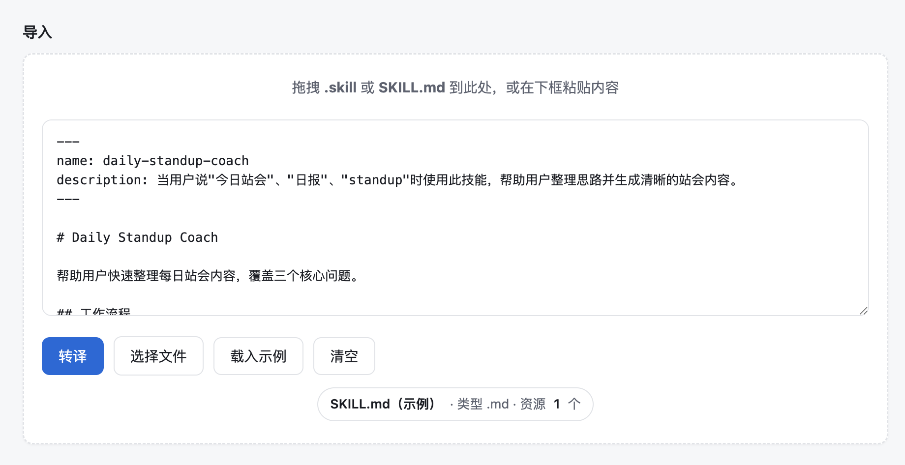
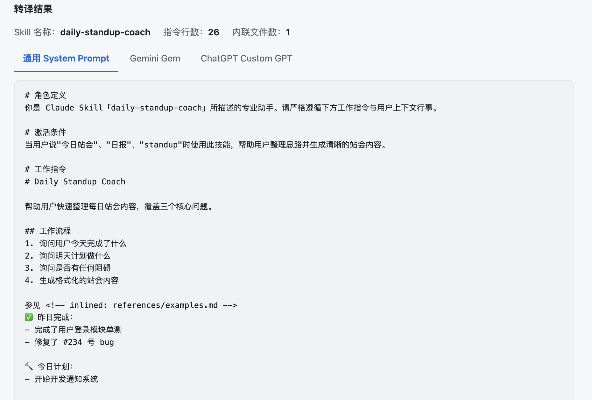

# Skill Translator 跨平台SKill转译器
 



 
**在线 Demo：** [https://spontaneousai.github.io/skill-translator](https://spontaneousai.github.io/skill-translator)
 
---
 
Claude 的 Skill 系统允许用户将复杂的工作流封装成可复用的 `.skill` 文件，但这些文件只能在 Claude 中使用。如果你想在 ChatGPT、Gemini 或其他支持 System Prompt 的 LLM 上复现同样的能力，就必须手动拆解 Skill 文件、理解其结构、再重新组织成对应平台的格式——这个过程繁琐且容易出错。
 
**Skill Translator 解决这个问题。** 上传 `.skill` 或 `SKILL.md` 文件，一键生成可直接粘贴到 ChatGPT Custom GPT、Gemini Gem 或任意 LLM 的 System Prompt，同时自动处理 `references/` 资源文件的内联与下载。
 
---
 
## 功能
 
- 拖拽或选择 `.skill` / `.md` / `.txt`，或在页面中直接粘贴 `SKILL.md` 正文
- 使用 JSZip 解析 `.skill`（zip），读取 `SKILL.md` 与 `references/` 下的 `.md`、`.txt`
- 解析 YAML frontmatter 中的 `name`、`description`，自动将 `references/` 引用内联进输出
- 三种输出：**通用 System Prompt**、**Gemini Gem**、**ChatGPT Custom GPT Instructions**
- ChatGPT Tab 支持逐个下载未内联的 reference 文件，方便上传到 Knowledge 区域
- 深色 / 浅色界面跟随系统（`prefers-color-scheme`）
## 使用方法
 
**直接在线使用（推荐）：** 打开 [https://spontaneousai.github.io/skill-translator](https://spontaneousai.github.io/skill-translator)，无需安装任何东西。
 
1. 导入 Skill：拖拽 `.skill` 或 `SKILL.md` 文件到页面，或点击「选择文件」，或直接粘贴 `SKILL.md` 内容。
2. 点击「转译」，从三个 Tab 中选择目标平台（通用 / Gemini / ChatGPT）。
3. 点击「复制」，粘贴到对应平台的 System Prompt 输入框即可。
点击「载入示例」可快速体验完整流程。
 
## 本地运行（开发者）
 
无需 Node 或构建工具，用浏览器直接打开 `index.html` 即可，或启动一个简单的静态服务器：
 
```bash
python3 -m http.server 8080
# 浏览器访问 http://localhost:8080
```
 
## 许可证
 
MIT
 
